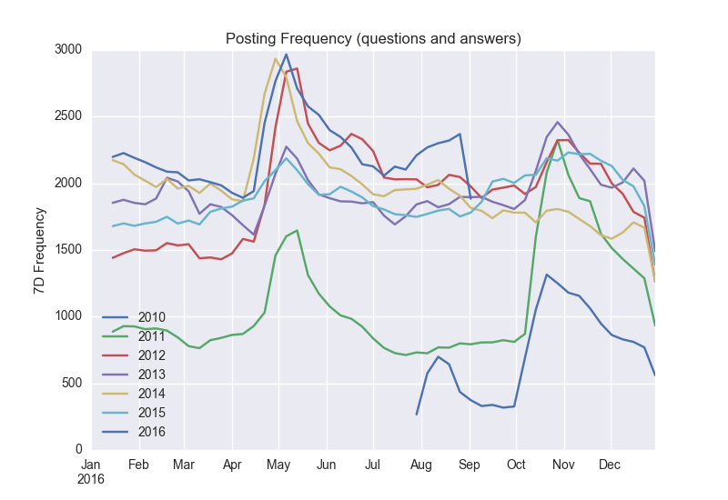
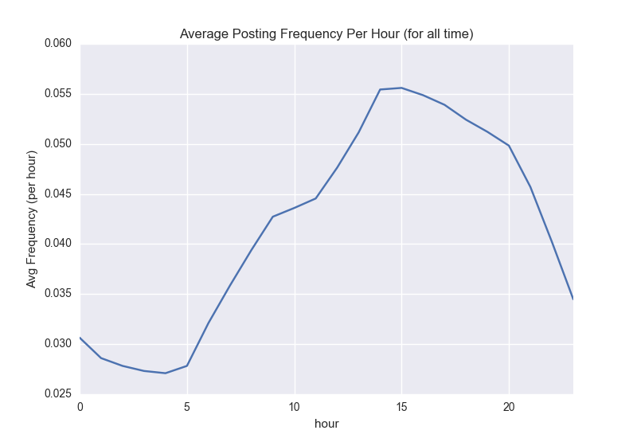
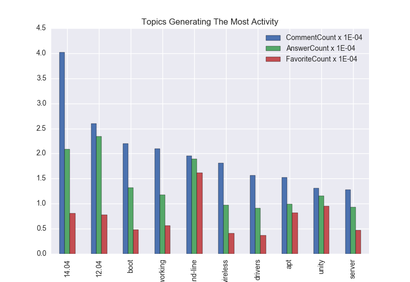
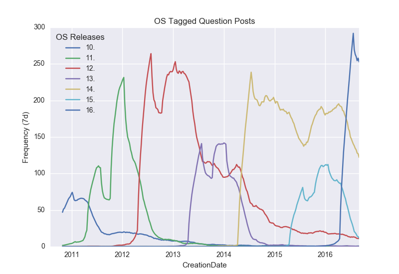
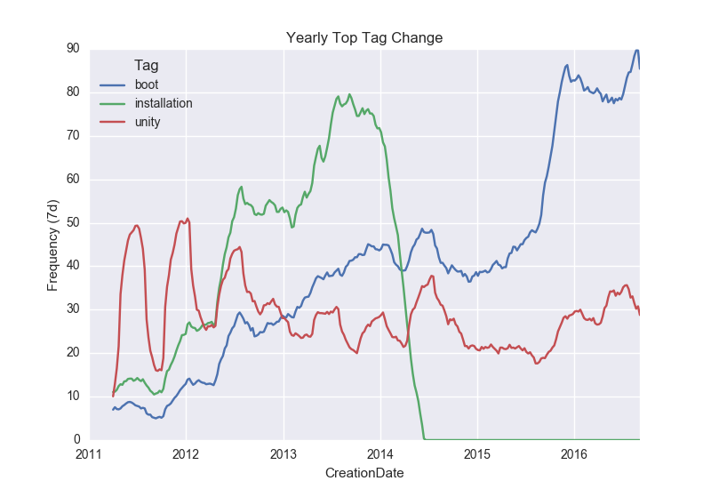

# Ask Ubuntu Data Dump Analysis
---------------------------------

## 1. what Are The Top Topics That Users Post About?
The tags on each question post are being considered topics.
A question post can have a maximum of 5 tags, where 75% of question posts have 1-3 tags.

This plot shows the top 11 tags between 2009-01-08 and 2016-09-04.

Top topics are choosen as the tags which appear in the top 15 for both **Count** and **ViewCount**.
Each metric has been scaled by the order of magnitue shown in the legend.

The top topics are also the most general topics, such as *command-line* and *networking*. A point for further investigation would be to look at the top tags co-occuring with each top tag. For instance it would be more useful to know that *bash* accounts for 90% of *command-line* questions.

## 2. What Are The Most Common Sentiments When User Post Questions?

Analysing the sentiment of posts is beyond the scope and timeframe I have for this project. With a little more time I could use a pretrained model for positive, neutral and negative sentiment classification, but since the language being used in these posts is very different from most pretrained models, the performance would most likely be poor.

The multilingual nature of this dataset adds another layer of complexity, since the most frequently used words (not including stop-words) in the **title** and **body** of all the posts are not english words.

## 3. How Do Posts Vary By Time Of Year And Time Of Day?
  

The sharp increase in posting frequency near the end of April, as well as the end of October, indicate strong seasonality. These are are correllated with \*\*.04 and \*\*.10 Ubuntu releases which roll out every six months. It is also evident (but less clear in this plot) that odd years have lower posting frequencies then even years, which correlates with LTS (Long Term Support) versions which are released on even years.

  

The even though the *CreationDate* datetime feature is very granular (down to the millisecond or microsecond), it is not epecially useful without the knowing the time zone of the user making the post. This information may be available in the Users.xml file.

## 5. Which Topics Generate The Most Activity On The Post?

Activity metrics require active interaction with a question post (i.e. answers, comments, favorites). 
Top activity tags shown are those that occur in the top 15 for each metric.

  
*grub2* is the only tag that appears in the top topics (**Count** and **ViewCount**), but not in the top activity. This suggests, not supprisingly, a collinear relationship between all of the tag metrics.

## 6. How Have The Nature Of Posts Evolved Over Time?

  
This plot shows how the Frequency of posts tagged with specific Ubuntu Releases has changed from 2010 - 2016. 

  
This plot shows the change in Frequency of posts with these tags. The tags list is the union of the top tag for each year.

#### [Fields](fields.md)
##### There are 6 metrics that can be used to evaluate each tag: 
* **Count**: The Frequency of the tag occuring in question posts
* **ViewCount**: How many times a given tag has been viewed
* **Score**: I believe this is the score of the User which made the post (not as relevant)
* **CommentCount**: number of comments on each post with a given tag
* **AnswerCount**: number of answers on each post with a given tag
* **FavoriteCount**: number of times a post with this tag has been upvoted